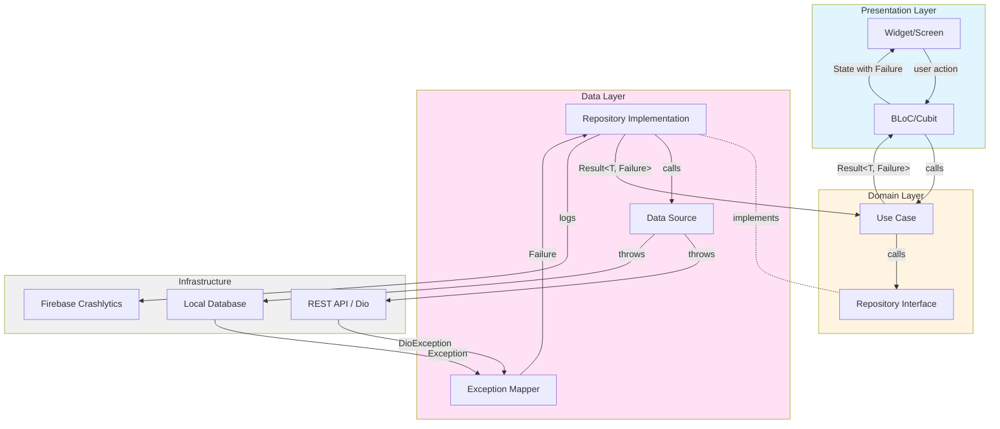
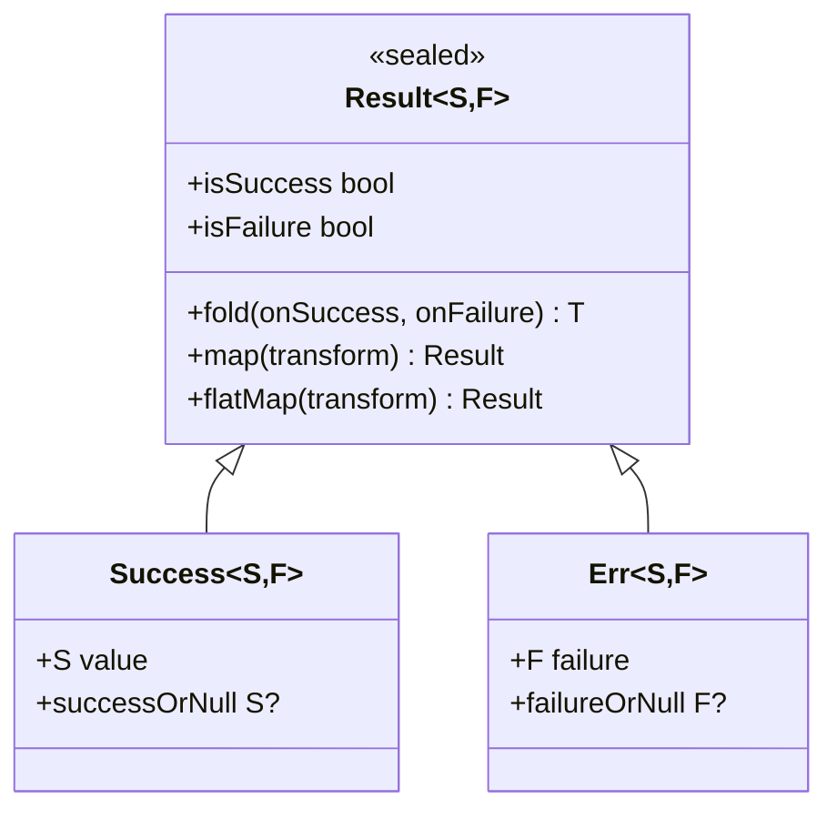
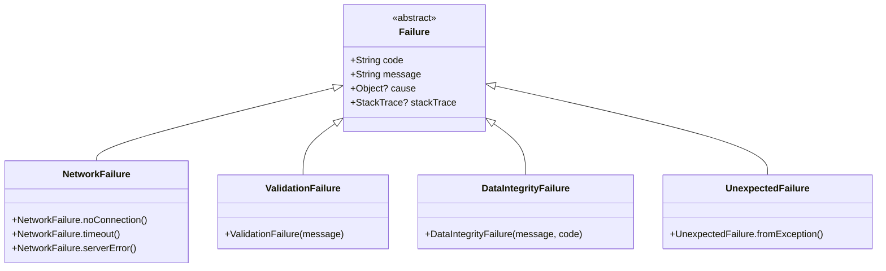
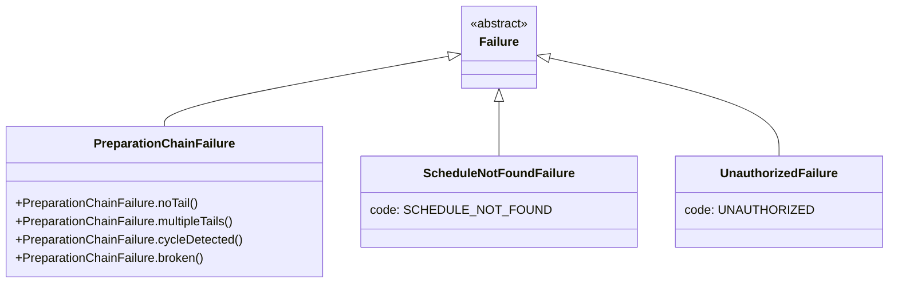
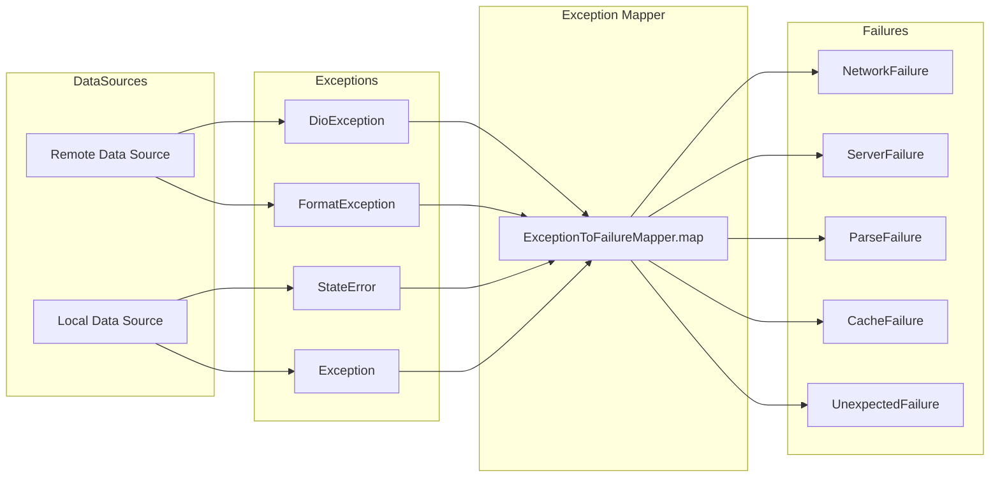
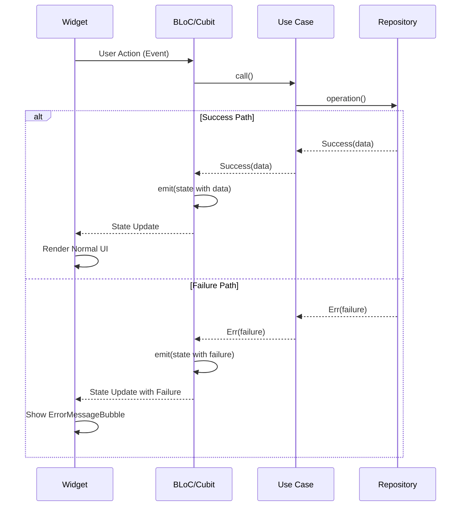
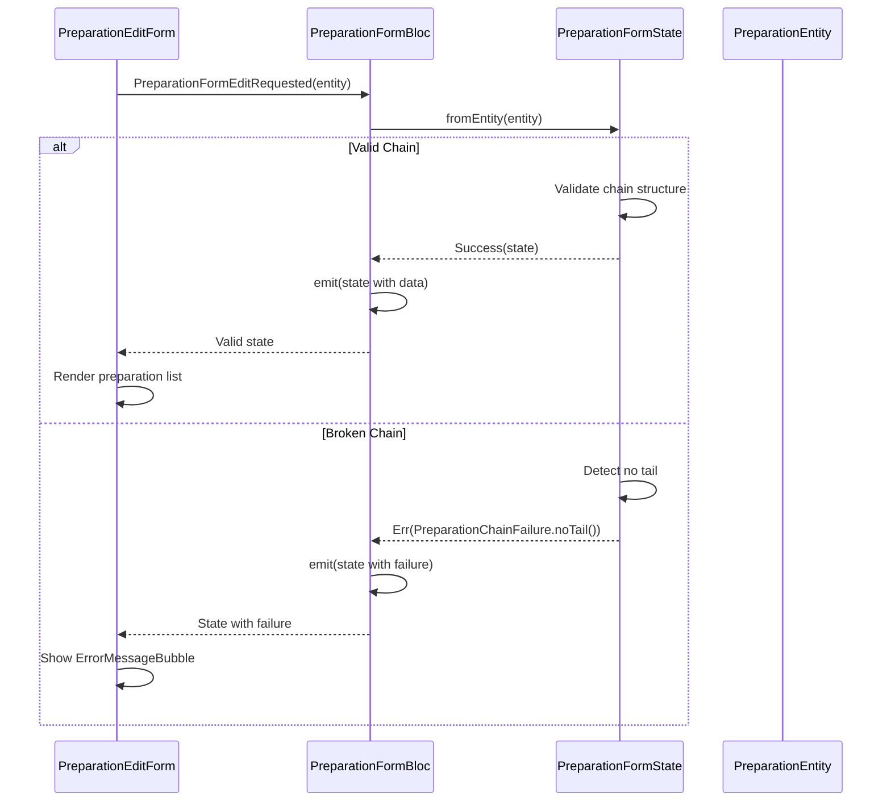
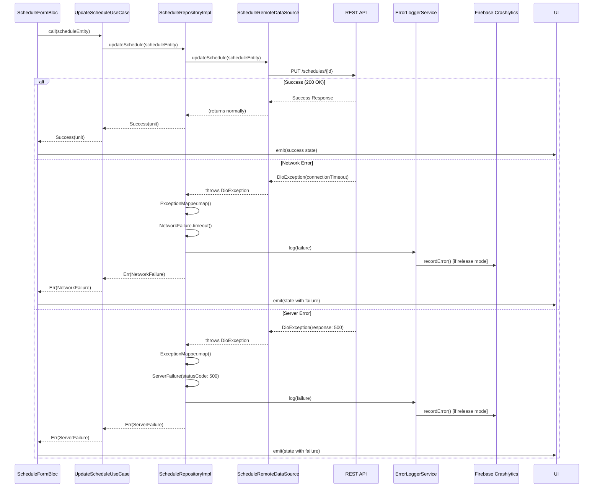
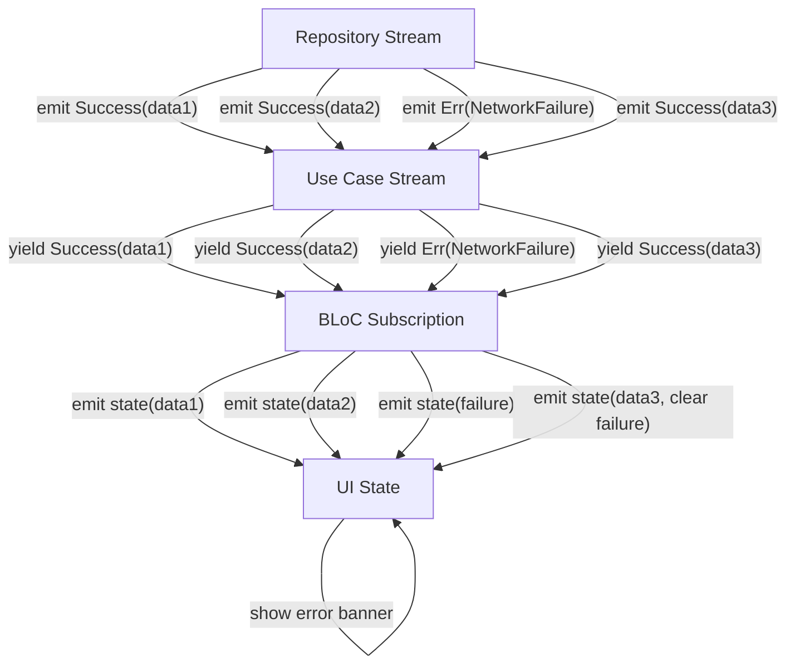
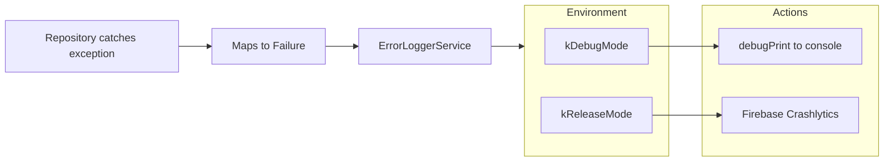

# Result-based Error Handling System

## Overview

This document describes the comprehensive error handling architecture implemented across all layers of the application using the **Result pattern**. This system ensures type-safe error propagation from data sources to the UI, with automatic logging and environment-aware error messaging.

## Design Principles

### Core Principles

1. **Explicit Error Handling**: All operations that can fail return `Result<Success, Failure>` types, making error handling mandatory and visible in type signatures
2. **No Silent Failures**: Invalid data or broken business rules never produce incorrect but valid-looking states
3. **Layer-Appropriate Failures**: Each layer defines failures appropriate to its abstraction level
4. **Type Safety**: The compiler enforces error handling - you cannot ignore failures
5. **User-Friendly Messages**: Technical details in debug mode, localized friendly messages in production
6. **Automatic Logging**: All failures are automatically logged to Firebase Crashlytics in production

### Why Result Pattern?

Traditional exception-based error handling has several problems:

- Exceptions can be silently ignored (no compiler enforcement)
- Return types don't indicate possible failures
- Easy to forget `try/catch` blocks
- Difficult to distinguish between different error types

The Result pattern solves these by making errors explicit in the type system.

## Architecture Overview



## Layer-by-Layer Implementation

### 1. Core Layer: Foundation Types

The core layer provides the fundamental building blocks for error handling.

#### Result Type



**Location**: `lib/core/error/result.dart`

**Key Methods**:

- `fold<T>({onSuccess, onFailure})` - Handle both cases explicitly
- `map<S2>(transform)` - Transform success value
- `flatMap<S2>(transform)` - Chain operations that return Result
- `successOrNull` / `failureOrNull` - Convenience getters

#### Failure Hierarchy



**Location**: `lib/core/error/failures.dart`

**Design Pattern**: Each failure type has factory constructors for common scenarios.

#### Unit Type

For operations that don't return a value (like `void`), we use `Unit`:

```dart
Future<Result<Unit, Failure>> deleteSchedule(...) async {
  // ... perform deletion
  return Success(unit); // unit is a singleton instance
}
```

**Location**: `lib/core/error/unit.dart`

### 2. Domain Layer: Business Failures

Domain failures represent business rule violations without any infrastructure details.



**Location**: `lib/domain/errors/domain_failures.dart`

**Example Codes**:

- `PREP_NO_TAIL` - No step has `nextPreparationId = null`
- `PREP_MULTIPLE_TAILS` - Multiple steps have `nextPreparationId = null`
- `PREP_CYCLE_DETECTED` - Steps form a cycle
- `PREP_BROKEN_CHAIN` - Not all steps are connected

#### Repository Interfaces

Domain repositories declare failure possibilities in their signatures:

```dart
abstract interface class PreparationRepository {
  // Streams can emit failures
  Stream<Result<Map<String, PreparationEntity>, Failure>> get preparationStream;

  // Async operations return Result
  Future<Result<Unit, Failure>> updatePreparationByScheduleId(
    PreparationEntity preparationEntity,
    String scheduleId,
  );

  Future<Result<PreparationEntity, Failure>> getDefualtPreparation();
}
```

**Key Point**: Domain layer knows nothing about HTTP status codes, Dio exceptions, or database errors.

### 3. Data Layer: Exception Mapping

The data layer catches infrastructure exceptions and maps them to domain-appropriate failures.



**Location**: `lib/data/errors/`

#### Data Failures

- `ServerFailure` - HTTP 400-599 responses with status code and message
- `CacheFailure` - Local storage/database errors
- `ParseFailure` - JSON parsing or data transformation errors

#### Exception Mapping Strategy

```dart
class ExceptionToFailureMapper {
  static Failure map(Object exception, StackTrace stackTrace) {
    return switch (exception) {
      DioException(type: DioExceptionType.connectionTimeout) =>
        NetworkFailure.timeout(/* ... */),
      DioException(type: DioExceptionType.connectionError) =>
        NetworkFailure.noConnection(/* ... */),
      DioException(response: final resp?) when resp.statusCode != null =>
        ServerFailure(/* ... */),
      FormatException() || JsonUnsupportedObjectError() =>
        ParseFailure(/* ... */),
      StateError() =>
        CacheFailure(/* ... */),
      _ =>
        UnexpectedFailure.fromException(/* ... */),
    };
  }
}
```

#### Repository Implementation Pattern

```dart
@Singleton(as: PreparationRepository)
class PreparationRepositoryImpl implements PreparationRepository {
  final PreparationRemoteDataSource _remoteDataSource;
  final ErrorLoggerService _errorLogger;

  @override
  Future<Result<Unit, Failure>> updatePreparationByScheduleId(
      PreparationEntity preparationEntity, String scheduleId) async {
    try {
      await _remoteDataSource.updatePreparationByScheduleId(
          preparationEntity, scheduleId);
      _updateStream(scheduleId, preparationEntity);
      return Success(unit);
    } catch (e, stackTrace) {
      final failure = ExceptionToFailureMapper.map(e, stackTrace);
      await _errorLogger.log(failure, hint: 'updatePreparationByScheduleId');
      return Err(failure);
    }
  }
}
```

**Key Pattern**: Catch everything, map to Failure, log, return Err.

### 4. Presentation Layer: Error Display



#### State Structure

BLoC states include an optional failure field:

```dart
class PreparationFormState extends Equatable {
  final List<PreparationStepFormState> preparationStepList;
  final PreparationFormStatus status;
  final bool isValid;
  final Failure? failure; // ← Error field

  @override
  List<Object?> get props => [preparationStepList, status, isValid, failure];
}
```

#### Event Handler Pattern

```dart
void _onPreparationFormEditRequested(
  PreparationFormEditRequested event,
  Emitter<PreparationFormState> emit,
) {
  final result = PreparationFormState.fromEntity(event.preparationEntity);

  result.fold(
    onSuccess: (preparationFormState) {
      emit(state.copyWith(
        status: PreparationFormStatus.success,
        preparationStepList: preparationFormState.preparationStepList,
        failure: null, // Clear any previous failure
      ));
    },
    onFailure: (failure) {
      emit(state.copyWith(
        status: PreparationFormStatus.error,
        failure: failure, // Store failure in state
        preparationStepList: const [], // Safe fallback
      ));
    },
  );
}
```

#### UI Error Display

```dart
BlocBuilder<PreparationFormBloc, PreparationFormState>(
  builder: (context, state) {
    return Column(
      children: [
        // Show error bubble if failure exists
        if (state.failure != null)
          ErrorMessageBubble(
            errorMessage: Text(state.failure!.toUserMessage(context)),
          ),
        // ... rest of UI
      ],
    );
  },
)
```

#### User Message Conversion

**Location**: `lib/presentation/shared/extensions/failure_extensions.dart`

```dart
extension FailureMessage on Failure {
  String toUserMessage(BuildContext context) {
    final l10n = AppLocalizations.of(context)!;

    // Debug mode: show technical details
    if (kDebugMode) {
      return '$code: $message';
    }

    // Production mode: user-friendly messages
    return switch (this) {
      NetworkFailure() => l10n.error, // Use localized strings
      ValidationFailure(:final message) => message,
      PreparationChainFailure() => l10n.error,
      ServerFailure() => l10n.error,
      _ => l10n.error, // Fallback
    };
  }
}
```

**Pattern**: Detailed in debug, generic/localized in production.

## Error Flow Examples

### Example 1: Data Integrity Validation (Domain Layer)

**Scenario**: Loading a preparation chain with broken links



**Key Validation Points**:

1. No tail (no step with `nextPreparationId = null`)
2. Multiple tails (more than one step with `nextPreparationId = null`)
3. Cycle detected (step chain loops back)
4. Broken chain (not all steps are connected)

### Example 2: Network Operation (Data Layer)

**Scenario**: Updating a schedule via REST API



### Example 3: Stream-based Operations

**Scenario**: Real-time schedule updates



**Pattern**: Streams can emit either `Success` or `Err`. UI subscribes and updates accordingly.

## Error Logging System

### Architecture



**Location**:

- Interface: `lib/core/services/error_logger_service.dart`
- Implementation: `lib/core/services/crashlytics_error_logger_service.dart`

### Logging Strategy

**Debug Mode**:

- Print all failure details to console
- Include code, message, cause, stackTrace
- No Crashlytics calls

**Release Mode (non-web)**:

- Record error to Firebase Crashlytics
- Include custom keys: `failure_code`, `failure_hint`
- Attach stackTrace and cause

**Web Platform**:

- Crashlytics not available
- Errors logged to console only

### Integration with Dependency Injection

The logger is automatically injected into all repositories:

```dart
@Singleton(as: PreparationRepository)
class PreparationRepositoryImpl implements PreparationRepository {
  final ErrorLoggerService _errorLogger; // Injected

  PreparationRepositoryImpl({
    required ErrorLoggerService errorLoggerService,
    // ... other dependencies
  }) : _errorLogger = errorLoggerService;
}
```

## Testing Error Handling

### Unit Testing Result-based Code

#### Testing Success Cases

```dart
test('Valid chain reconstructs correctly', () {
  final entity = PreparationEntity(preparationStepList: [
    stepEntity(id: 'A', name: 'A', time: Duration(minutes: 1), nextId: null),
  ]);

  final result = PreparationFormState.fromEntity(entity);

  // Verify it's a success
  expect(result.isSuccess, true);

  // Extract and verify the value
  final state = result.successOrNull!;
  expect(state.preparationStepList.length, 1);
  expect(state.preparationStepList[0].id, 'A');
});
```

#### Testing Failure Cases

```dart
test('Broken chain returns PreparationChainFailure', () {
  final entity = PreparationEntity(preparationStepList: [
    stepEntity(id: 'A', name: 'A', time: Duration(minutes: 1), nextId: 'B'),
    // Missing B - broken chain
  ]);

  final result = PreparationFormState.fromEntity(entity);

  // Verify it's a failure
  expect(result.isFailure, true);

  // Use fold to check failure details
  result.fold(
    onSuccess: (_) => fail('Should not succeed with broken chain'),
    onFailure: (failure) {
      expect(failure, isA<PreparationChainFailure>());
      expect(failure.code, 'PREP_NO_TAIL');
    },
  );
});
```

#### Testing Multiple Failure Scenarios

```dart
group('PreparationChainFailure scenarios', () {
  test('No tail returns PREP_NO_TAIL', () {
    final entity = PreparationEntity(preparationStepList: [
      stepEntity(id: 'A', nextId: 'B'),
      stepEntity(id: 'B', nextId: 'A'), // Cycle, no tail
    ]);

    final result = PreparationFormState.fromEntity(entity);
    expect(result.failureOrNull?.code, 'PREP_NO_TAIL');
  });

  test('Multiple tails returns PREP_MULTIPLE_TAILS', () {
    final entity = PreparationEntity(preparationStepList: [
      stepEntity(id: 'A', nextId: null),
      stepEntity(id: 'B', nextId: null), // Two tails
    ]);

    final result = PreparationFormState.fromEntity(entity);
    expect(result.failureOrNull?.code, 'PREP_MULTIPLE_TAILS');
  });

  test('Cycle detected returns PREP_CYCLE_DETECTED', () {
    final entity = PreparationEntity(preparationStepList: [
      stepEntity(id: 'A', nextId: 'B'),
      stepEntity(id: 'B', nextId: 'C'),
      stepEntity(id: 'C', nextId: 'A'), // Forms cycle
      stepEntity(id: 'D', nextId: null), // Separate tail
    ]);

    final result = PreparationFormState.fromEntity(entity);
    final failure = result.failureOrNull as PreparationChainFailure;
    expect(failure.code, 'PREP_CYCLE_DETECTED');
  });
});
```

### Integration Testing with Mocks

#### Mocking Repositories to Return Failures

```dart
class MockPreparationRepository extends Mock implements PreparationRepository {}

void main() {
  late PreparationFormBloc bloc;
  late MockPreparationRepository mockRepository;

  setUp(() {
    mockRepository = MockPreparationRepository();
    bloc = PreparationFormBloc(/* inject mock */);
  });

  blocTest<PreparationFormBloc, PreparationFormState>(
    'emits failure state when repository returns network error',
    build: () {
      // Mock repository to return failure
      when(() => mockRepository.getPreparationByScheduleId(any()))
          .thenAnswer((_) async => Err(NetworkFailure.noConnection()));
      return bloc;
    },
    act: (bloc) => bloc.add(LoadPreparation('schedule-123')),
    expect: () => [
      PreparationFormState(status: PreparationFormStatus.loading),
      PreparationFormState(
        status: PreparationFormStatus.error,
        failure: isA<NetworkFailure>(),
      ),
    ],
  );
}
```

### Widget Testing with Error States

```dart
testWidgets('shows ErrorMessageBubble when failure exists', (tester) async {
  await tester.pumpWidget(
    MaterialApp(
      home: BlocProvider(
        create: (_) => PreparationFormBloc(),
        child: PreparationEditForm(),
      ),
    ),
  );

  // Trigger failure state
  final bloc = tester.bloc<PreparationFormBloc>();
  bloc.add(PreparationFormEditRequested(
    preparationEntity: brokenChainEntity,
  ));
  await tester.pump();

  // Verify ErrorMessageBubble is shown
  expect(find.byType(ErrorMessageBubble), findsOneWidget);
  expect(find.text(contains('PREP_NO_TAIL')), findsOneWidget); // Debug mode
});
```

## Common Patterns & Best Practices

### Pattern 1: Handling Result in Use Cases

```dart
// Simple pass-through
Future<Result<Unit, Failure>> call(ScheduleEntity schedule) {
  return _repository.updateSchedule(schedule);
}

// Transform success value
Future<Result<int, Failure>> call(String scheduleId) async {
  final result = await _repository.getSchedule(scheduleId);
  return result.map((schedule) => schedule.attendeeCount);
}

// Chain multiple operations
Future<Result<Unit, Failure>> call() async {
  final result1 = await _prepRepo.updateDefaultPreparation(prep);
  if (result1.isFailure) return result1;

  final result2 = await _userRepo.getUser();
  return result2;
}

// Or use flatMap for chaining
Future<Result<Unit, Failure>> call() async {
  return (await _prepRepo.updateDefaultPreparation(prep))
      .flatMap((_) => _userRepo.getUser());
}
```

### Pattern 2: Stream Operations

```dart
// Transform stream of Results
Stream<Result<List<ScheduleEntity>, Failure>> call(
    DateTime start, DateTime end) async* {
  await for (final result in _repository.scheduleStream) {
    yield result.map((schedules) =>
        schedules.where((s) => s.isInRange(start, end)).toList());
  }
}

// Filter and transform
Stream<Result<ScheduleEntity?, Failure>> getUpcoming() async* {
  await for (final result in _repository.scheduleStream) {
    yield result.map((schedules) =>
        schedules.firstWhereOrNull((s) => s.isUpcoming));
  }
}
```

### Pattern 3: BLoC emit.forEach with Result

```dart
await emit.forEach(
  _getSchedulesByDateUseCase(startDate, endDate),
  onData: (result) {
    return result.fold(
      onSuccess: (schedules) => state.copyWith(
        status: Status.success,
        schedules: schedules,
        failure: null,
      ),
      onFailure: (failure) => state.copyWith(
        status: Status.error,
        failure: failure,
      ),
    );
  },
);
```

### Pattern 4: Validation in Presentation Layer

```dart
// Returns Result for operations that can fail during construction
static Result<PreparationFormState, Failure> fromEntity(
    PreparationEntity entity) {
  // Validate business rules
  if (!_isValidChain(entity)) {
    return Err(PreparationChainFailure.broken(/* ... */));
  }

  // Transform to presentation model
  final formSteps = _transformToFormSteps(entity);

  return Success(PreparationFormState(
    preparationStepList: formSteps,
    status: PreparationFormStatus.success,
  ));
}
```

## Adding New Failures

### Step-by-Step Guide

#### 1. Determine the Appropriate Layer

| Layer                                                 | Use When                          | Examples                                                   |
| ----------------------------------------------------- | --------------------------------- | ---------------------------------------------------------- |
| **Core** (`lib/core/error/failures.dart`)             | Generic, reusable across features | `NetworkFailure`, `ValidationFailure`, `UnexpectedFailure` |
| **Domain** (`lib/domain/errors/domain_failures.dart`) | Business rule violations          | `PreparationChainFailure`, `ScheduleNotFoundFailure`       |
| **Data** (`lib/data/errors/data_failures.dart`)       | Infrastructure-specific errors    | `ServerFailure`, `CacheFailure`, `ParseFailure`            |

#### 2. Create the Failure Class

```dart
// Domain failure example
class ScheduleOverlapFailure extends Failure {
  const ScheduleOverlapFailure({
    required String scheduleId,
    required String conflictingScheduleId,
    super.cause,
    super.stackTrace,
  }) : super(
    code: 'SCHEDULE_OVERLAP',
    message: 'Schedule $scheduleId overlaps with $conflictingScheduleId',
  );
}

// Data failure example
class ServerFailure extends Failure {
  final int statusCode;
  final String? serverMessage;

  const ServerFailure({
    required this.statusCode,
    this.serverMessage,
    super.cause,
    super.stackTrace,
  }) : super(
    code: 'HTTP_$statusCode',
    message: serverMessage ?? 'Server error ($statusCode)',
  );
}
```

#### 3. Return the Failure

```dart
// In repository
Future<Result<Unit, Failure>> createSchedule(ScheduleEntity schedule) async {
  try {
    // Check business rules
    if (_hasOverlap(schedule)) {
      return Err(ScheduleOverlapFailure(
        scheduleId: schedule.id,
        conflictingScheduleId: conflictId,
      ));
    }

    await _dataSource.createSchedule(schedule);
    return Success(unit);
  } catch (e, stackTrace) {
    final failure = ExceptionToFailureMapper.map(e, stackTrace);
    await _errorLogger.log(failure, hint: 'createSchedule');
    return Err(failure);
  }
}
```

#### 4. Handle in Presentation

```dart
// In BLoC
void _onScheduleCreated(ScheduleCreated event, Emitter<State> emit) async {
  final result = await _createScheduleUseCase(event.schedule);

  result.fold(
    onSuccess: (_) {
      emit(state.copyWith(
        status: Status.success,
        failure: null,
      ));
    },
    onFailure: (failure) {
      emit(state.copyWith(
        status: Status.error,
        failure: failure,
      ));
    },
  );
}
```

#### 5. (Optional) Add User Message Mapping

```dart
// In lib/presentation/shared/extensions/failure_extensions.dart
extension FailureMessage on Failure {
  String toUserMessage(BuildContext context) {
    final l10n = AppLocalizations.of(context)!;

    if (kDebugMode) return '$code: $message';

    return switch (this) {
      ScheduleOverlapFailure() => l10n.scheduleOverlapError,
      // ... other mappings
      _ => l10n.error,
    };
  }
}
```

#### 6. Add Localized Strings

```json
// lib/l10n/app_en.arb
{
  "scheduleOverlapError": "This schedule overlaps with another appointment",
  "@scheduleOverlapError": {
    "description": "Error shown when schedule times conflict"
  }
}

// lib/l10n/app_ko.arb
{
  "scheduleOverlapError": "다른 약속과 시간이 겹쳤어요"
}
```

## Migration Checklist

When converting existing code to use Result pattern:

### Repository

- [ ] Update interface to return `Result<T, Failure>`
- [ ] Add `ErrorLoggerService` dependency injection
- [ ] Wrap operations in `try/catch`
- [ ] Map exceptions using `ExceptionToFailureMapper`
- [ ] Log failures before returning
- [ ] Return `Success(value)` or `Err(failure)`
- [ ] Update stream types to `Stream<Result<T, Failure>>`

### Use Case

- [ ] Update return type to `Result<T, Failure>`
- [ ] Remove `try/catch` blocks (let Result flow through)
- [ ] Use `.map()` / `.flatMap()` for transformations
- [ ] For streams, yield `Result` values

### BLoC/Cubit

- [ ] Add `Failure? failure` field to state
- [ ] Update event handlers to use `.fold()`
- [ ] Emit state with failure on error path
- [ ] Clear failure on success path
- [ ] For `emit.forEach`, unwrap Result in `onData`

### UI/Widget

- [ ] Check `state.failure` and show `ErrorMessageBubble`
- [ ] Use `failure.toUserMessage(context)` for display

### Tests

- [ ] Test both success and failure paths
- [ ] Use `expect(result.isSuccess, true)` / `expect(result.isFailure, true)`
- [ ] Use `result.fold()` or `.failureOrNull` to inspect failure
- [ ] Mock repositories to return specific failures
- [ ] Verify UI shows ErrorMessageBubble for failure states

## Troubleshooting

### Common Issues

**Issue**: "Result type doesn't match"

```
Error: The argument type 'Result<X, Failure>' can't be assigned
to the parameter type 'X'
```

**Solution**: You're passing a Result where the unwrapped value is expected. Use `.fold()`, `.successOrNull`, or await and handle the Result.

**Issue**: "Can't return void from Result function"

```
Error: A value of type 'Result<Unit, Failure>' can't be returned
from the method because it has a return type of 'Future<void>'
```

**Solution**: Change return type from `Future<void>` to `Future<Result<Unit, Failure>>`.

**Issue**: "Failures not showing in UI"
**Solution**:

1. Check BLoC state includes `Failure? failure` field
2. Verify event handler calls `emit(state.copyWith(failure: failure))`
3. Ensure UI checks `state.failure != null` and renders ErrorMessageBubble

**Issue**: "Tests failing after migration"
**Solution**: Update test expectations to check `Result` instead of raw values:

```dart
// Before
expect(await useCase.call(), someValue);

// After
final result = await useCase.call();
expect(result.isSuccess, true);
expect(result.successOrNull, someValue);
```

## Advanced Topics

### Custom Result Extension Methods

You can add domain-specific extensions:

```dart
extension ResultExtensions<S, F> on Result<S, F> {
  // Get value or provide default
  S getOrDefault(S defaultValue) {
    return successOrNull ?? defaultValue;
  }

  // Convert to nullable without throwing
  S? toNullable() => successOrNull;

  // Log failure and return null
  S? orLogAndNull(ErrorLoggerService logger) {
    if (this is Err<S, F>) {
      logger.log((this as Err<S, F>).failure);
    }
    return successOrNull;
  }
}
```

### Combining Multiple Results

```dart
// Sequential (short-circuit on first failure)
Future<Result<Unit, Failure>> updateBoth() async {
  return (await _repo1.update())
      .flatMap((_) => _repo2.update());
}

// Parallel (collect all failures)
Future<Result<Unit, Failure>> updateMultiple() async {
  final results = await Future.wait([
    _repo1.update(),
    _repo2.update(),
    _repo3.update(),
  ]);

  final failures = results
      .where((r) => r.isFailure)
      .map((r) => r.failureOrNull!)
      .toList();

  if (failures.isNotEmpty) {
    return Err(UnexpectedFailure(
      message: 'Multiple operations failed: ${failures.length}',
      code: 'MULTIPLE_FAILURES',
    ));
  }

  return Success(unit);
}
```

### Retry Logic

```dart
Future<Result<T, Failure>> withRetry<T>(
  Future<Result<T, Failure>> Function() operation, {
  int maxAttempts = 3,
  Duration delay = const Duration(seconds: 1),
}) async {
  var attempts = 0;

  while (attempts < maxAttempts) {
    final result = await operation();

    if (result.isSuccess) return result;

    // Retry on network failures only
    if (result.failureOrNull is NetworkFailure && attempts < maxAttempts - 1) {
      attempts++;
      await Future.delayed(delay * attempts);
      continue;
    }

    return result;
  }

  return Err(NetworkFailure.timeout(
    message: 'Operation failed after $maxAttempts attempts',
  ));
}
```

## Summary

### Key Takeaways

1. **Result type** makes error handling explicit and type-safe
2. **Failure hierarchy** provides structured error information across layers
3. **Automatic logging** captures errors in production without manual intervention
4. **Environment-aware messaging** shows details to developers, friendly messages to users
5. **Testing** is straightforward with clear success/failure paths
6. **Migration** is systematic: update signatures layer-by-layer from data → domain → presentation

### Quick Reference

```dart
// Return Result from operations
Future<Result<Unit, Failure>> operation() async {
  try {
    // ... do work
    return Success(unit);
  } catch (e, stackTrace) {
    final failure = ExceptionToFailureMapper.map(e, stackTrace);
    await _logger.log(failure);
    return Err(failure);
  }
}

// Handle Result in BLoC
result.fold(
  onSuccess: (value) => emit(state.copyWith(data: value, failure: null)),
  onFailure: (failure) => emit(state.copyWith(failure: failure)),
);

// Test Result
expect(result.isSuccess, true);
expect(result.successOrNull, expectedValue);

// Or
result.fold(
  onSuccess: (value) => expect(value, expectedValue),
  onFailure: (_) => fail('Should not fail'),
);
```

### Benefits

✅ **Compiler-enforced error handling** - Cannot forget to handle failures  
✅ **Clear failure propagation** - Errors flow upward through Result types  
✅ **Better debugging** - Structured failures with codes and context  
✅ **Production safety** - Automatic logging without manual try/catch everywhere  
✅ **Testability** - Easy to test both success and failure scenarios  
✅ **Maintainability** - Consistent pattern across entire codebase
