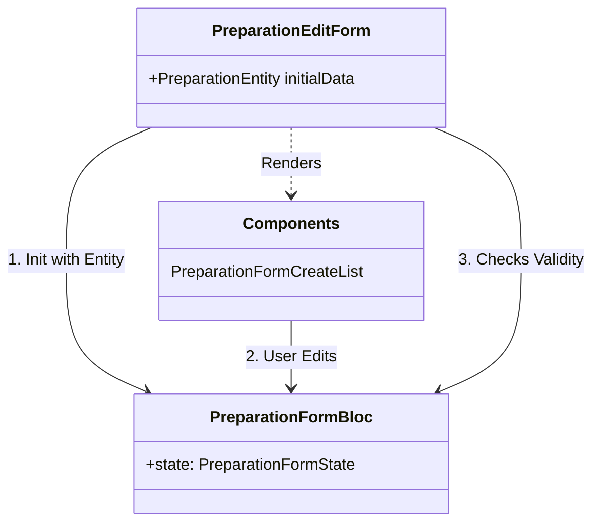
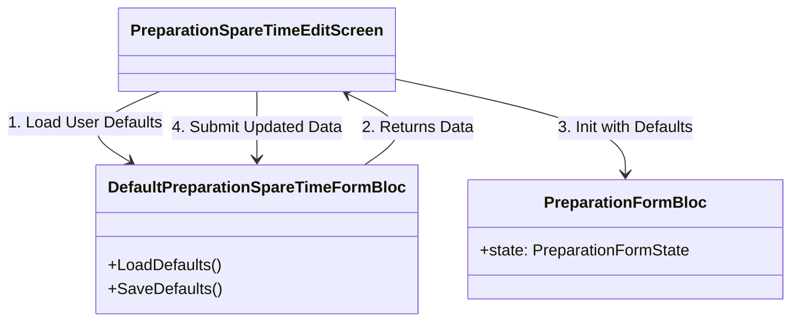
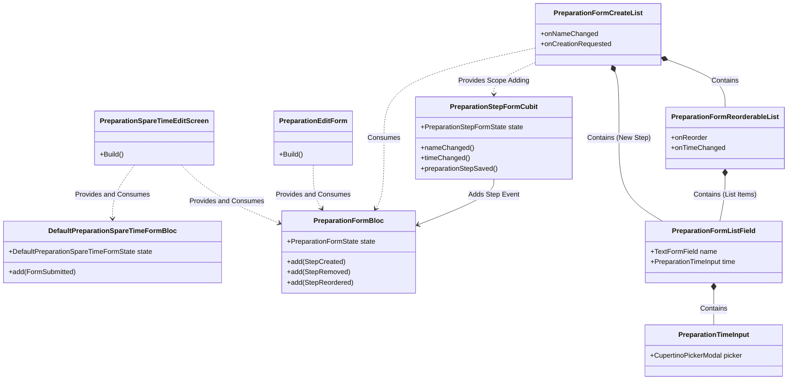
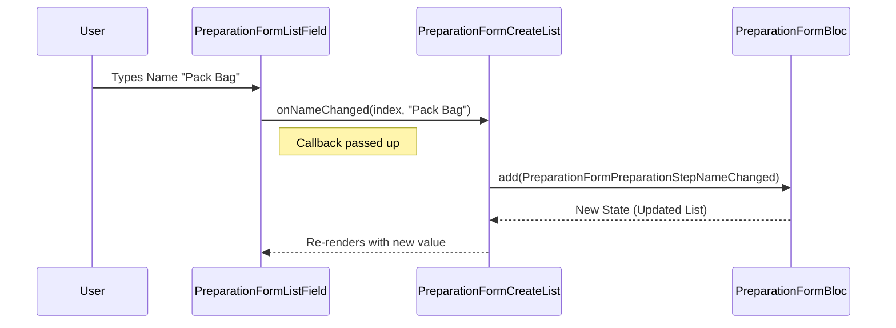
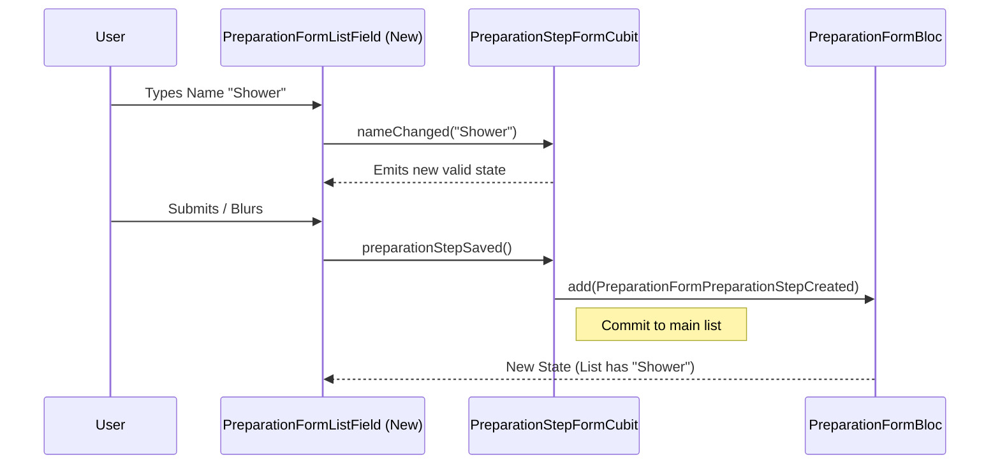
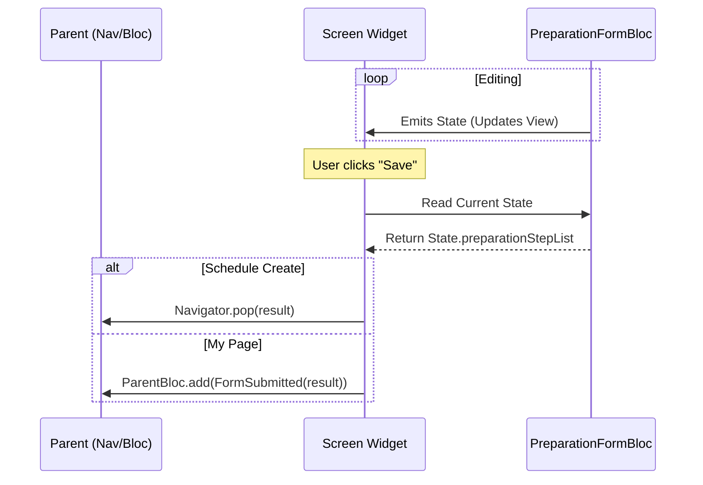

# Preparation Form Structure

This document outlines the architecture, component structure, and responsibilities of the Preparation Form used in the application. This form is utilized in two primary contexts:

1.  **Schedule Creation**: Defining preparation steps for a new schedule.
2.  **My Page**: Editing default preparation and spare time settings.

## Architecture Overview

The preparation form is built using the **BLoC (Business Logic Component)** pattern for state management and **Flutter Widgets** for UI composition. It relies on a primary BLoC (`PreparationFormBloc`) to manage the list of preparation steps and a temporary Cubit (`PreparationStepFormCubit`) for handling the input of new steps before they are committed to the list.

### Usage Scenarios

| Feature             | Screen                           | Parent Bloc                           | Description                                                                                                                |
| :------------------ | :------------------------------- | :------------------------------------ | :------------------------------------------------------------------------------------------------------------------------- |
| **Schedule Create** | `PreparationEditForm`            | N/A                                   | Used directly within the schedule creation flow. Initializes `PreparationFormBloc` with an existing entity or empty state. |
| **My Page**         | `PreparationSpareTimeEditScreen` | `DefaultPreparationSpareTimeFormBloc` | Used to edit user's default settings. Wraps the form logic and handles saving to the user repository.                      |

## Class Responsibilities

### State Management (Blocs & Cubits)

#### `PreparationFormBloc`

**Responsibility**: Manages the main state of the preparation form.

- **State**: Holds the list of `PreparationStepFormState` (the steps), validation status (`isValid`), and the current form status (e.g., `adding`, `initial`).
- **Actions**:
  - Handling edits to existing steps (name, time).
  - Reordering steps.
  - Removing steps.
  - Adding new steps (committed from the cubit).
  - Validating the entire list.

#### `DefaultPreparationSpareTimeFormBloc`

**Responsibility**: Manages the "My Page" specific logic for editing default preparation and spare time.

- **State**: Holds the user's current default preparation entity and spare time duration.
- **Actions**:
  - Fetching existing defaults on load.
  - Updating spare time (increase/decrease).
  - Submitting the final `PreparationEntity` (derived from `PreparationFormBloc`) and spare time to the backend/database.

#### `PreparationStepFormCubit`

**Responsibility**: Manages the _transient_ state of a new preparation step being created.

- **Scope**: Created only when the user clicks "add step" and is typing in the new step details.
- **State**: Holds the `PreparationNameInputModel` and `PreparationTimeInputModel` for the new step.
- **Actions**:
  - Validating real-time input for the new step.
  - Triggering the "save" action which adds the step to the parent `PreparationFormBloc`.

### UI Components

#### `PreparationFormCreateList`

**Responsibility**: The main container widget for the preparation form UI.

- **Composition**:
  - Displays the list of existing steps using `PreparationFormReorderableList`.
  - Conditionally displays the input field for a new step using `PreparationStepFormCubit` and `PreparationFormListField` when in `adding` mode.
  - Displays the "Add" button (`CreateIconButton`).

#### `PreparationFormReorderableList`

**Responsibility**: Renders the list of existing steps with reordering and deletion capabilities.

- **Features**:
  - Wraps `ReorderableListView` to allow drag-and-drop sorting.
  - Implements `SwipeActionCell` for swipe-to-delete functionality.
  - Delegates rendering of individual items to `PreparationFormListField`.

#### `PreparationFormListField`

**Responsibility**: Renders a single preparation step row.

- **Usage**: Used for both _existing_ items (in the list) and the _new_ item (in the add section).
- **Features**:
  - Displays the drag handle (if reorderable).
  - Displays the name input field (`TextFormField`).
  - Displays the time input widget (`PreparationTimeInput`).
  - Handles focus management and "save on submit/blur" logic for new items.

#### `PreparationTimeInput`

**Responsibility**: A specialized widget for selecting duration.

- **Features**:
  - Displays the current duration in minutes.
  - Opens a `CupertinoPickerModal` on tap for selecting the time.

## Component Diagrams

The following diagrams illustrate the relationships and data flow for each specific usage context.

### Diagram 1: Schedule Create Flow

In the Schedule Create flow, `PreparationEditForm` directly initializes and interacts with `PreparationFormBloc`. This is a simpler flow focused on defining steps for a specific schedule.

### Diagram 2: My Page Flow

In the My Page flow, `PreparationSpareTimeEditScreen` first uses `DefaultPreparationSpareTimeFormBloc` to load the user's default settings. It then initializes `PreparationFormBloc` with these defaults. The final submission goes back through `DefaultPreparationSpareTimeFormBloc` to save changes.

### Overall Component Relationships

This diagram shows the detailed relationships between screens, state management classes, and UI components across the system.

## Data Flow & Communication

The components communicate using a combination of **Bloc Events** (upward), **Callbacks** (upward), and **Widget Properties** (downward).

### Communication Pattern

1.  **Downward (Data Passing)**:

    - Parent widgets pass state and data down to children via constructor arguments (parameters).
    - Example: `PreparationFormCreateList` receives the list of steps (`preparationStepList`) from `PreparationFormBloc`'s state and passes individual steps down to `PreparationFormReorderableList` and `PreparationFormListField`.

2.  **Upward (Events & Actions)**:

    - Child widgets notify parents of user interactions via callback functions (e.g., `onNameChanged`).
    - These callbacks eventually trigger BLoC events (e.g., `PreparationFormPreparationStepNameChanged`) to update the global state.
    - For complex temporary state (like adding a new item), a Cubit (`PreparationStepFormCubit`) is used to hold the state locally before "committing" it up to the main BLoC.

3.  **Upward (Form Submission)**:
    - When the form is complete (saved), the UI extracts the final state from the `PreparationFormBloc`.
    - The UI then passes this data "up" to the navigation stack (pop) or to a parent BLoC (`DefaultPreparationSpareTimeFormBloc`).
    - _Note: `PreparationFormBloc` does not directly call its parent context; the UI acts as the coordinator._

### Data Flow Diagrams

#### 1. Editing an Existing Step (List Item)

This flow illustrates how a change in a child component updates the central BLoC state.

#### 2. Adding a New Step

This flow shows the interaction between the temporary Cubit and the main BLoC.

#### 3. Submitting the Form

This flow shows how the data leaves `PreparationFormBloc` and goes to the parent context.

