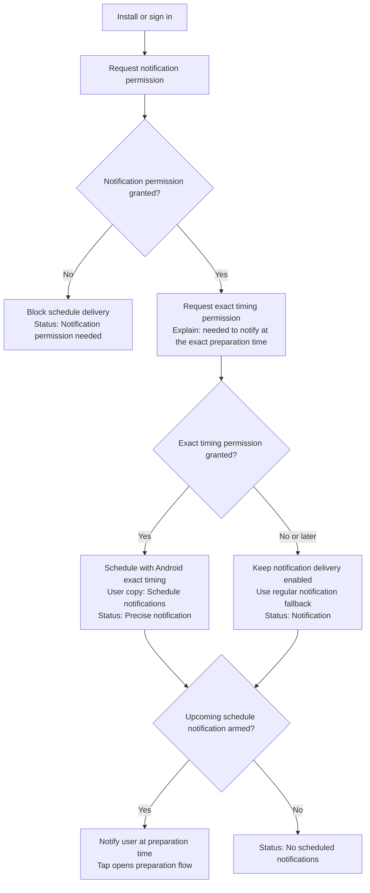
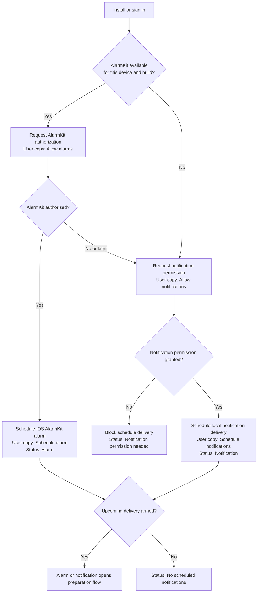

# Schedule Notification Flow

This page records the platform-specific schedule delivery flow for OnTime. The
product language is intentional:

- **Notification** means the user is alerted through an OS notification.
- **Alarm** means OnTime can present a stronger alarm experience without the
  user first tapping a notification.
- Android currently uses notification-based schedule delivery.
- iOS uses alarm language only when AlarmKit is available and authorized.

## Android Flow

Android separates notification display permission from exact timing permission.
Users may still receive schedule notifications when exact timing is denied, but
delivery is approximate.

## iOS Flow

iOS is capability-aware. Alarm language is correct only when AlarmKit can be used
for the current device and build. Otherwise, OnTime uses notification language.

## Profile Status Labels

| Platform / capability state | User-facing status |
| --- | --- |
| Android exact timing armed | Precise notification |
| Android notification fallback armed | Notification |
| iOS AlarmKit armed | Alarm |
| iOS notification fallback armed | Notification |
| Notification permission missing | Notification permission needed |
| No upcoming delivery armed | No scheduled notifications |
| User disabled schedule delivery | Off |

## Copy Rules

- Android permission prompts should say **notification**, not alarm.
- Android exact timing copy should explain why the extra permission exists:
  OnTime needs it to notify the user at the exact time to start preparing.
- iOS prompts may say **alarm** only when requesting AlarmKit authorization.
- Empty states should stay platform-neutral: **No scheduled notifications**.

## Source Of Truth

- Domain language: `CONTEXT.md`
- Android decision: `docs/adr/0008-use-notification-based-schedule-delivery-on-android.md`
- iOS decision: `docs/adr/0009-use-alarm-language-only-for-ios-alarmkit.md`
- Permission gate: `lib/presentation/app/cubit/alarm_gate_cubit.dart`
- Startup allow screen: `lib/presentation/alarm_allow/screens/alarm_allow_screen.dart`
- Profile status: `lib/presentation/my_page/my_page_screen.dart`
