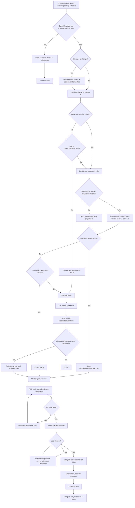
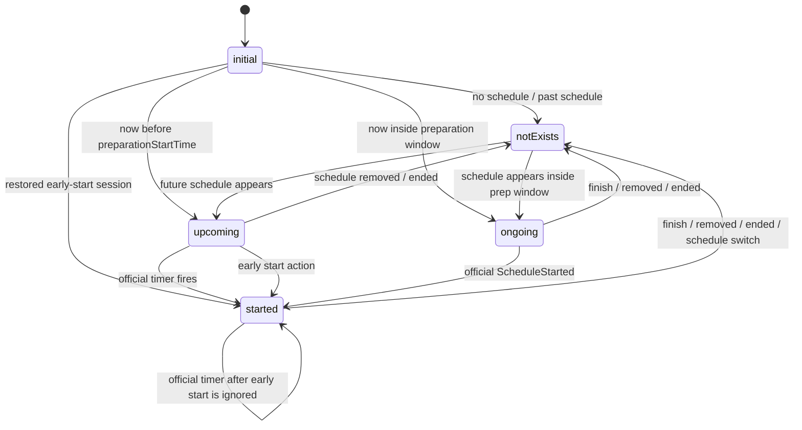
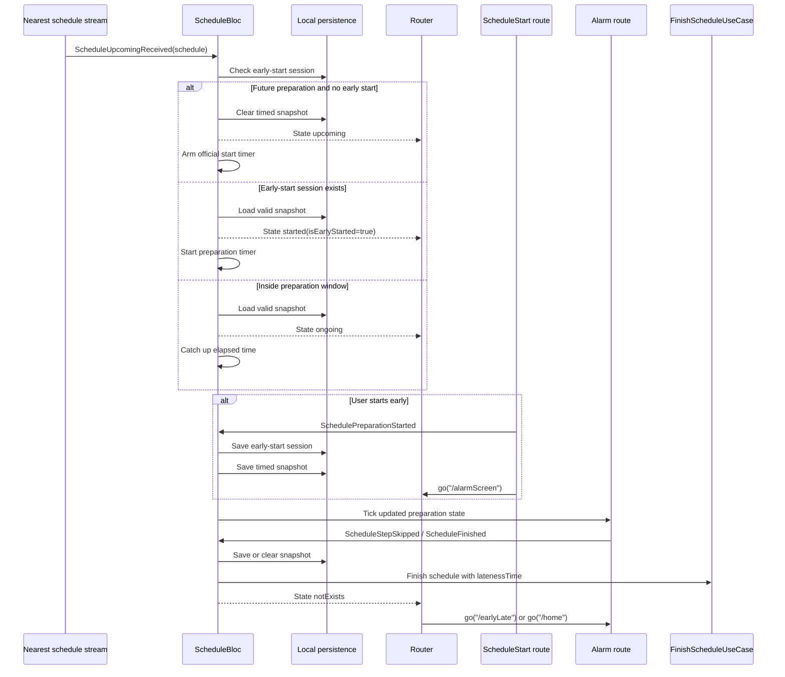
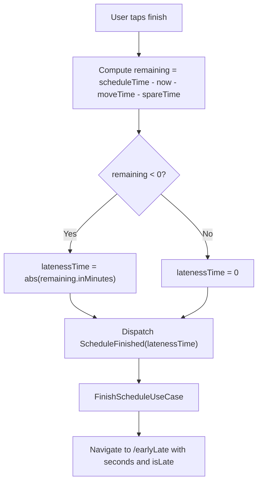

# Schedule Preparation Flow SRD

This document defines the software requirements for preparing for a schedule from the moment a schedule becomes eligible for preparation until the preparation flow ends. It includes official start, early start, delayed entry, runtime ticking, step completion, finish, late/early result, persistence, and cleanup behavior.

## Scope

This SRD covers:

- Schedule selection and preparation-window classification.
- User entry from Home, notification, `/scheduleStart`, and `/alarmScreen`.
- Early start before the calculated preparation start time.
- Official preparation start at the calculated preparation start time.
- Runtime preparation timer behavior.
- Step skip, step completion, all-steps-done continuation, and finish.
- Late/early result calculation.
- Persistence and recovery after app restart.
- Cache invalidation after schedule mutation, finish, end, or schedule switch.

This SRD does not cover schedule creation form field validation except where created schedule data affects preparation timing.

## Terms

| Term | Meaning |
| --- | --- |
| `scheduleTime` | Appointment time. |
| `moveTime` | Travel time required before appointment. |
| `scheduleSpareTime` | User buffer time before appointment. Null is treated as zero. |
| `preparation.totalDuration` | Sum of all preparation step durations. |
| `totalDuration` | `moveTime + preparation.totalDuration + scheduleSpareTime`. |
| `preparationStartTime` | `scheduleTime - totalDuration`. |
| Leave threshold | `scheduleTime - moveTime - scheduleSpareTime`. |
| Early start | User begins preparation before `preparationStartTime`. |
| Official start | System begins the start prompt at `preparationStartTime`. |
| Late entry | User/app enters after `preparationStartTime` but before `scheduleTime`. |
| `latenessTime` | Positive minutes late at finish, or `0` when not late. |

## Actors

- User: starts early, starts at prompt, skips steps, finishes, continues after all steps, leaves the screen.
- Schedule runtime: `ScheduleBloc`, timers, stream subscription, cache restore, notification dispatch.
- Router: maps runtime state to `/scheduleStart`, `/alarmScreen`, `/earlyLate`, or `/home`.
- Persistence layer: stores early-start sessions and timed preparation snapshots.
- Backend/use cases: provide nearest upcoming schedule and persist schedule completion.

## Source of Truth

The active preparation schedule comes from `GetNearestUpcomingScheduleUseCase`. The runtime holds only one current schedule at a time. Persisted local state can restore progress only if it matches the current schedule fingerprint.

Relevant code:

- `lib/domain/entities/schedule_with_preparation_entity.dart`
- `lib/domain/entities/preparation_with_time_entity.dart`
- `lib/presentation/app/bloc/schedule/schedule_bloc.dart`
- `lib/presentation/alarm/screens/schedule_start_screen.dart`
- `lib/presentation/alarm/screens/alarm_screen.dart`
- `lib/presentation/home/utils/today_tile_navigation.dart`
- `lib/presentation/shared/router/go_router.dart`

## Timing Requirements

1. The system shall calculate `preparationStartTime` as:

```text
scheduleTime - moveTime - preparation.totalDuration - scheduleSpareTime
```

1. The system shall calculate remaining leave time as:

```text
scheduleTime - now - moveTime - scheduleSpareTime
```

1. The system shall classify the active schedule at runtime:

| Runtime condition | Required state |
| --- | --- |
| No schedule | `notExists` |
| `scheduleTime < now` | `notExists` |
| Restorable early-start session exists | `started(isEarlyStarted=true)` |
| `now < preparationStartTime` | `upcoming` |
| `preparationStartTime < now < scheduleTime` | `ongoing` |
| User starts preparation | `started` |

1. At the exact official start boundary, the system shall transition from `upcoming` to `started` through `ScheduleStarted`.

## End-to-End Flow



## Entry Flows

### Flow A: Upcoming Schedule, User Does Nothing

Preconditions:

- Nearest schedule exists.
- `now < preparationStartTime`.
- No early-start session exists.

Requirements:

1. Runtime shall emit `upcoming`.
1. Runtime shall clear any timed snapshot for the schedule to avoid restoring stale pre-start progress.
1. Runtime shall arm a timer for `preparationStartTime`.
1. When the timer fires, runtime shall dispatch `ScheduleStarted`.
1. If this schedule has not already been early-started, runtime shall emit `started`, push `/scheduleStart`, and start the preparation timer.

### Flow B: Upcoming Schedule, User Starts Early From Home

Preconditions:

- Nearest schedule exists.
- `now < preparationStartTime`.
- Home tile navigation resolves to `/scheduleStart` with the early-start prompt.

Requirements:

1. `/scheduleStart` shall show an early-start prompt that explains how much earlier the user is starting.
1. Primary action shall dispatch `SchedulePreparationStarted`.
1. Runtime shall mark an early-start session for the schedule id.
1. Runtime shall cancel the official start timer.
1. Runtime shall emit `started(isEarlyStarted=true)`.
1. Runtime shall save an initial timed-preparation snapshot.
1. UI shall navigate to `/alarmScreen`.
1. The preparation timer shall start at zero elapsed time, not at `now - preparationStartTime`.

### Flow C: Five-Minute Reminder Starts The Same Early-Start Flow

Preconditions:

- App receives or opens from a reminder about five minutes before preparation should start.
- `now < preparationStartTime`.

Requirements:

1. The program shall treat this as the same early-start flow as Flow B.
1. The program should not require a separate `fiveMinutes` prompt variant for runtime behavior.
1. The prompt should still present the same decision:
   - Primary action: "Start preparing now".
   - Secondary action: "Not now".
1. Primary action shall dispatch `SchedulePreparationStarted` and navigate to `/alarmScreen`.
1. Secondary action shall navigate to `/home`.
1. Any existing legacy route payload such as `isFiveMinutesBefore=true` shall be treated as an early-start prompt for backward compatibility only.

### Flow D: Upcoming Schedule, User Opens Alarm Screen Directly

Preconditions:

- Nearest schedule exists.
- Runtime state is `upcoming`.
- User/route opens `/alarmScreen` before official start.

Requirements:

1. `/alarmScreen` shall not show an indefinite loading spinner.
1. It shall show an early-start-ready screen with schedule name, countdown, start button, and home button.
1. Start button shall dispatch `SchedulePreparationStarted`.
1. Home button shall navigate to `/home` without starting preparation.

### Flow E: Notification Opens Preparation Runtime

Preconditions:

- User taps a local or background notification.
- Notification payload has `type` starting with `schedule_` or `preparation_`, or it contains `scheduleId`.

Requirements:

1. Notification handler shall push `/alarmScreen` when the notification is a general schedule/preparation notification.
1. Notification handler shall push the early-start prompt when the notification is a five-minute reminder.
1. Alarm screen shall request schedule subscription on entry.
1. Runtime shall classify the nearest upcoming schedule normally.
1. If the schedule is still `upcoming`, alarm shall show early-start-ready UI.
1. If the schedule is `ongoing` or `started`, alarm shall show active preparation UI.
1. If no active schedule exists, alarm shall fall back through `notExists` handling and navigate home.

### Flow F: Official Start Prompt

Preconditions:

- Runtime transitions through `ScheduleStarted`.
- User is not early-started.

Requirements:

1. Runtime shall emit `started`.
1. Runtime shall push `/scheduleStart`.
1. Default prompt primary action shall navigate to `/alarmScreen`.
1. Default prompt primary action shall not dispatch `SchedulePreparationStarted`; the runtime has already started through `ScheduleStarted`.

### Flow G: Delayed Entry Into Preparation Window

Preconditions:

- Nearest schedule exists.
- `preparationStartTime < now < scheduleTime`.
- No early-start session exists.

Requirements:

1. Runtime shall emit `ongoing`.
1. Runtime shall start the preparation timer.
1. Runtime shall immediately catch up preparation progress by:

```text
now - preparationStartTime - alreadyElapsedPreparation
```

1. Catch-up elapsed time shall complete earlier steps and partially progress the current step as needed.
1. Step-change notification shall be sent only when the current step changes to a non-first step that has not already been notified for this schedule.

### Flow H: Restored Early-Start Session

Preconditions:

- Early-start session exists for incoming schedule id.
- App restarts or schedule stream re-emits.

Requirements:

1. Runtime shall restore the session by emitting `started(isEarlyStarted=true)`.
1. Runtime shall load a timed snapshot when available.
1. Runtime shall use the snapshot only if its fingerprint equals the incoming schedule fingerprint.
1. Runtime shall fast-forward restored preparation by `now - snapshot.savedAt`.
1. Runtime shall start the preparation timer.
1. `/scheduleStart` builder shall resolve directly to `AlarmScreen` when `isEarlyStarted=true` to prevent route bounce.

### Flow I: Restored Ongoing Session Without Early Start

Preconditions:

- No early-start session exists.
- `now >= preparationStartTime`.
- Valid timed snapshot exists.

Requirements:

1. Runtime shall restore the snapshot when fingerprint matches.
1. Runtime shall fast-forward by `now - snapshot.savedAt`.
1. Runtime shall emit `ongoing` if still before `scheduleTime`.
1. Runtime shall start the preparation timer.

### Flow J: Stale Snapshot Or Schedule Mutation

Preconditions:

- Timed snapshot exists.
- Incoming schedule fingerprint differs from snapshot fingerprint.

Requirements:

1. Runtime shall clear timed snapshot.
1. Runtime shall clear early-start session for that schedule id.
1. Runtime shall use canonical incoming preparation from the schedule stream.
1. Runtime shall classify the schedule again using current time.

Fingerprint inputs:

- `scheduleTime`
- `moveTime`
- `scheduleSpareTime`
- Preparation step id
- Preparation step name
- Preparation step duration
- Preparation step next id

### Flow K: User Skips Current Step

Preconditions:

- Runtime state is `ongoing` or `started`.
- Current preparation step exists.

Requirements:

1. Skip action shall mark only the current step as done.
1. Runtime shall emit updated schedule state.
1. Runtime shall save a timed snapshot immediately.
1. Next tick shall continue from the next incomplete step.

### Flow L: All Preparation Steps Complete

Preconditions:

- Runtime state is `ongoing` or `started`.
- `preparation.isAllStepsDone == true`.

Requirements:

1. Alarm screen shall show completion dialog once per schedule completion state.
1. Dialog shall offer finish and continue.
1. The system shall not automatically finish the schedule when all preparation steps are done.
1. The system shall treat preparation completion and lateness as separate concerns.
1. If all preparation steps are done before the leave threshold, the user is still on time.
1. If the user continues, alarm screen shall keep showing live leave countdown.
1. While continuing before the leave threshold, UI should communicate "ready / time remaining to leave" rather than "late".
1. If the user becomes late while continuing, UI shall switch to late-continue mode.
1. Finishing remains available after continuing.

### Flow M: User Finishes Preparation

Preconditions:

- Runtime state has an active schedule.
- User taps finish from alarm screen or completion dialog.

Requirements:

1. UI shall compute `timeRemainingBeforeLeaving`.
1. If remaining leave time is negative, UI shall send positive late minutes to `ScheduleFinished`.
1. If remaining leave time is zero or positive, UI shall send `0` to `ScheduleFinished`.
1. Runtime shall call `FinishScheduleUseCase(scheduleId, latenessTime)`.
1. Runtime shall cancel preparation and schedule-start timers.
1. Runtime shall clear timed snapshot and early-start session.
1. Runtime shall emit `notExists`.
1. Alarm listener shall navigate to `/earlyLate` when finish was user-initiated and late/early data is pending.
1. Otherwise, alarm listener shall navigate to `/home`.

### Flow N: Schedule Ends, Is Deleted, Or Stream Emits Null

Preconditions:

- Active stream emits `null`, or schedule time is already before now.

Requirements:

1. Runtime shall clear persisted state for the stale or current schedule id when known.
1. Runtime shall emit `notExists`.
1. Runtime shall clear current id, active early-start id, snapshot timestamp, and notification tracking.
1. Alarm listener shall return the user to `/home` unless a finish navigation is pending.

### Flow O: Schedule Switch While Preparing

Preconditions:

- Current schedule id differs from newly emitted schedule id.

Requirements:

1. Runtime shall clear persisted state for the previous schedule id.
1. Runtime shall remove notification tracking for the previous schedule id.
1. Runtime shall set the incoming schedule id as current.
1. Runtime shall classify the incoming schedule from scratch.

## State Model



## Route Requirements

| User/runtime state | Route behavior |
| --- | --- |
| Home tile + `upcoming` + schedule exists | Navigate to `/scheduleStart` with the early-start prompt. |
| Five-minute reminder notification | Navigate to `/scheduleStart` with the early-start prompt. |
| Home tile + `ongoing` | Navigate to `/alarmScreen`. |
| Home tile + `started` | Navigate to `/alarmScreen`. |
| Home tile + `initial`/`notExists`/no schedule | No navigation target. |
| Runtime official start | Push `/scheduleStart`. |
| `/scheduleStart` while `isEarlyStarted=true` | Build `AlarmScreen` directly. |
| `/alarmScreen` while `upcoming` | Show early-start-ready UI. |
| Finish success with pending result | Navigate to `/earlyLate`. |
| `notExists` without pending result | Navigate to `/home`. |

## Start Prompt Variants

The program should model start prompts with only two semantic variants:

```dart
enum ScheduleStartPromptVariant {
  officialStart,
  earlyStart,
}
```

Requirements:

1. `officialStart` means the calculated preparation time has arrived and the user should start preparing.
1. `earlyStart` means the user is being offered the choice to prepare before the calculated preparation time.
1. Five-minute reminder entry is not a separate runtime variant; it is an early-start source.
1. Legacy values such as `fiveMinutes` or `isFiveMinutesBefore=true` may be accepted at route boundaries, but shall normalize to `earlyStart`.

## Runtime Sequence



## Persistence Requirements

### Early-start session

Storage key:

```text
early_start_session_<scheduleId>
```

Payload:

```json
{
  "startedAt": 1773997200000
}
```

Requirements:

1. Save when user dispatches `SchedulePreparationStarted`.
1. Load during schedule resolution.
1. Clear on finish, schedule end, schedule deletion/null, fingerprint mismatch, or schedule switch.

### Timed preparation snapshot

Storage key:

```text
preparation_with_time_<scheduleId>
```

Payload fields:

- `savedAt`
- `scheduleFingerprint`
- `steps[].id`
- `steps[].name`
- `steps[].time`
- `steps[].nextId`
- `steps[].elapsed`
- `steps[].isDone`

Requirements:

1. Save immediately on early start.
1. Save immediately when a step is skipped.
1. Save immediately when the current step changes.
1. Save periodically, but not more often than every five seconds unless forced.
1. Restore only when schedule fingerprint matches.
1. Fast-forward after restore by elapsed wall-clock time since `savedAt`.
1. Clear when the schedule is future and no early-start session exists.
1. Clear on finish, schedule end, schedule deletion/null, fingerprint mismatch, or schedule switch.

## Late/Early Result Requirements



Requirements:

1. Step completion does not determine lateness.
1. Lateness is determined only by the leave threshold at finish time.
1. Finishing all steps early can still become late if the user chooses to continue and crosses the leave threshold.
1. Completing all steps after the expected preparation duration is not late by itself when there is still time before the leave threshold.
1. `earlyLateTime` passed to `/earlyLate` shall preserve seconds and sign from remaining leave time.
1. Backend finish payload shall use minutes, with `0` for non-late finish.

## Notification Requirements

1. Runtime shall initialize notification tracking per schedule id.
1. Runtime shall notify when current step changes to a new non-first step.
1. Runtime shall not notify for the first step.
1. Runtime shall not notify the same step id more than once per schedule id.
1. Runtime shall clear notification tracking when schedule ends or switches.

## Resolved Design Questions

The following decisions were answerable from the codebase and are treated as the recommended answers.

| Question | Recommended answer |
| --- | --- |
| Should early start consume the elapsed time between early start and official start? | Yes, but from early-start moment forward. It must not fast-forward by `now - preparationStartTime` before official start. |
| Should official start still show `/scheduleStart` after an early start? | No. It is a no-op for the same early-started schedule. |
| Should all steps done automatically finish the schedule? | No. Show a completion dialog; user chooses finish or continue. |
| Should step completion decide late status? | No. Late status is calculated only at finish time. |
| Should an old snapshot restore after schedule details change? | No. Fingerprint mismatch clears snapshot and early-start session. |
| Should opening `/alarmScreen` before official start be allowed? | Yes. It shows early-start-ready UI. |
| Should the app recover active early-start after restart? | Yes. Restore early-start session and valid snapshot, then fast-forward. |
| Should a user be able to leave the preparation screen without finishing? | Yes. Close/leave confirmation can return to home; persisted state enables restoration. |

## Acceptance Criteria

### Schedule classification

- Given no active schedule, runtime emits `notExists`.
- Given a past schedule, runtime clears persisted state and emits `notExists`.
- Given a future schedule before preparation start, runtime emits `upcoming`.
- Given a schedule inside preparation window, runtime emits `ongoing` and catches up elapsed preparation.
- Given a valid early-start session, runtime emits `started(isEarlyStarted=true)`.

### Early start

- Home tile for `upcoming` schedule opens early-start prompt.
- Early-start prompt primary action starts preparation and navigates to alarm.
- Early start saves session and snapshot.
- Official timer does not reopen start prompt after early start.
- Route builder avoids bounce by resolving `/scheduleStart` to alarm when early-started.

### Runtime timer

- Preparation timer ticks every second while active.
- Current step changes when elapsed time reaches step duration.
- Skipped step is marked done and saved immediately.
- Snapshot saves are throttled except forced saves.

### Finish

- Finish calls `FinishScheduleUseCase` exactly once per finish action.
- Non-late finish sends `latenessTime=0`.
- Late finish sends positive late minutes.
- Finish clears timers, early-start session, and timed snapshot.
- Finish redirects to `/earlyLate` with seconds and late flag.

### Persistence

- Valid snapshot restores elapsed step state.
- Invalid snapshot clears and uses canonical schedule preparation.
- Schedule switch clears previous persisted state.
- Schedule mutation prevents stale progress resurrection.

## Open Risks And Follow-Up Questions

These are not blockers for the current implementation, but they should be decided before expanding product behavior.

1. Late minute rounding: UI currently uses `abs(inMinutes)`, which floors partial late minutes. Decide whether backend lateness should floor or ceil partial minutes.
1. Exact-boundary classification: `_isPreparationOnGoing` uses strict `start.isBefore(now)`, while the official timer handles boundary start. Keep tests around exact equality.
1. Multiple schedules near the same time: current runtime assumes one nearest upcoming schedule. Product should define tie-breaking on the backend/use case.
1. Notification permission failure: runtime attempts step notifications through `NotificationService`; product should define fallback UX if permission is unavailable.
1. Leaving without finishing: state persists, but product should decide whether returning home should show a stronger "preparation still active" affordance.

## Test Coverage Map

Primary tests:

- `test/presentation/app/bloc/schedule/schedule_bloc_test.dart`
- `test/presentation/alarm/screens/preparation_flow_widget_test.dart`
- `test/domain/entities/preparation_timing_entity_test.dart`
- `test/presentation/home/utils/today_tile_navigation_test.dart`

Recommended additions:

- Boundary finish where remaining leave time is exactly zero.
- Partial-minute late finish rounding decision after product alignment.
- Schedule switch while a completion dialog is visible.
- Notification permission denied during step change.
