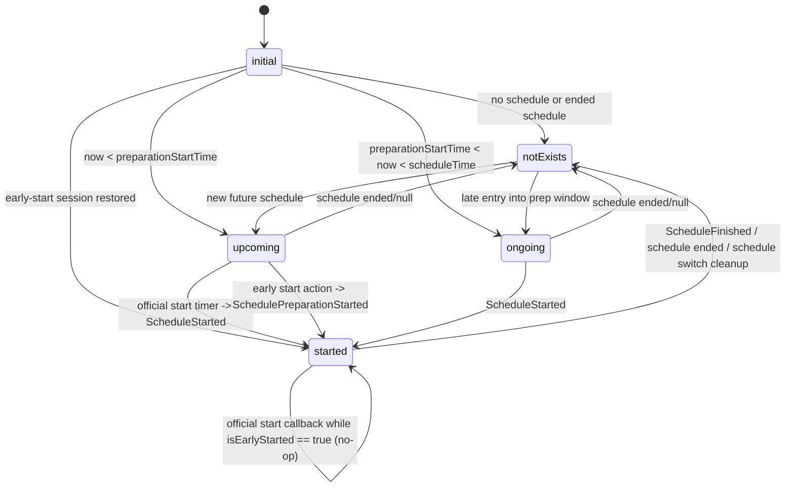
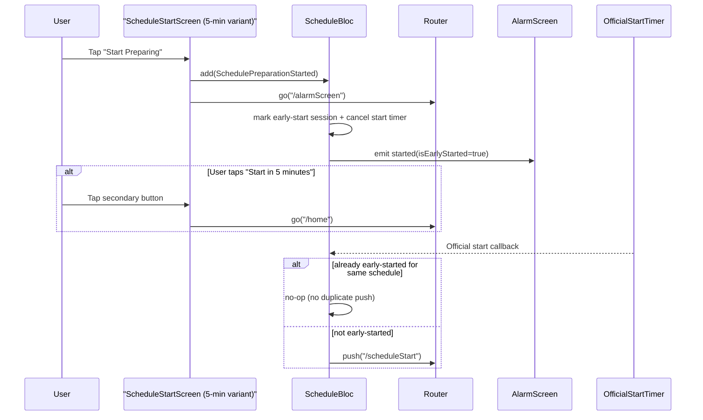
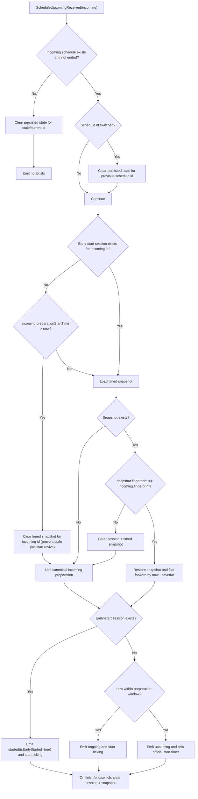

# Schedule Timer & Preparation Runtime Flow (v2)

This document is the canonical runtime-flow reference for preparation timing in OnTime.
It covers official schedule-start timing, early start, cache coherence, resume behavior, finish semantics, and verification scenarios.

## Purpose and Scope

The runtime flow decides:

- Which schedule state should be active (`initial`, `notExists`, `upcoming`, `ongoing`, `started`)
- When to open `/scheduleStart` and `/alarmScreen`
- How early-start sessions survive app restarts
- When cached timed-preparation is valid, restored, or invalidated
- How lateness is computed at finish time

## Core Invariants

1. `step completion != lateness`
- Completing all steps early does not mean late.
- Lateness is decided only when finishing preparation (`ScheduleFinished`) relative to leave threshold.

2. No route bounce after early start
- If the user already early-started a schedule, official start callback must not reopen `/scheduleStart`.

3. No stale cache resurrection after schedule mutation
- Timed-preparation snapshots are valid only when `scheduleFingerprint` matches the current schedule payload.
- Fingerprint mismatch clears persisted session/snapshot and resets to canonical preparation.

## Runtime State Model

### State meanings

- `initial`: bloc boot state before schedule resolution.
- `notExists`: no active schedule to prepare, or schedule already ended.
- `upcoming`: current time is before `preparationStartTime`.
- `ongoing`: current time is between `preparationStartTime` and `scheduleTime`.
- `started`: preparation start flow is active (including early start path).
- `isEarlyStarted`: flag on `ScheduleState` to mark early-started session context while in `started`.

### State transitions


```mermaid
stateDiagram-v2
    [*] --> initial
    initial --> notExists: no schedule or ended schedule
    initial --> upcoming: now < preparationStartTime
    initial --> ongoing: preparationStartTime < now < scheduleTime
    initial --> started: early-start session restored

    upcoming --> started: official start timer -> ScheduleStarted
    upcoming --> started: early start action -> SchedulePreparationStarted
    upcoming --> notExists: schedule ended/null

    ongoing --> started: ScheduleStarted
    ongoing --> notExists: schedule ended/null

    started --> started: official start callback while isEarlyStarted == true (no-op)
    started --> notExists: ScheduleFinished / schedule ended / schedule switch cleanup

    notExists --> upcoming: new future schedule
    notExists --> ongoing: late entry into prep window
```

## Entry Paths, Router Behavior, and Finish Semantics

### Entry paths

1. Official timer start
- In `upcoming`, bloc starts a timer targeting `preparationStartTime`.
- Timer callback dispatches `ScheduleStarted`.
- If not early-started, `/scheduleStart` is pushed.

2. 5-minute variant start-now
- On `/scheduleStart` (`isFiveMinutesBefore=true`), primary action dispatches `SchedulePreparationStarted` and navigates to `/alarmScreen`.
- Secondary action navigates to `/home`.

3. Delayed entry
- If user enters during `ongoing`, bloc applies catch-up elapsed time and begins ticking from current clock.

4. Stale/ended schedule path
- If schedule is already ended or stream emits `null`, state goes `notExists`.
- Alarm listener redirects safely to `/home` instead of remaining in a loading state.

### Router and UX rules

- `/scheduleStart` builder checks `ScheduleState.isEarlyStarted`.
- If early-start is active, `/scheduleStart` resolves directly to `AlarmScreen` (no bounce).
- `/alarmScreen` in `upcoming` shows early-start-ready UI (countdown + start + home), not indefinite spinner.

### Finish semantics

- Finish before leave threshold -> `lateness=0`.
- Finish after leave threshold -> positive lateness minutes.
- Completion dialog copy is late-aware:
late case uses running-late wording, non-late case uses completion wording.

### Sequence flow


```mermaid
sequenceDiagram
    participant User
    participant Start as "ScheduleStartScreen (5-min variant)"
    participant Bloc as ScheduleBloc
    participant Router
    participant Alarm as AlarmScreen
    participant Timer as OfficialStartTimer

    User->>Start: Tap "Start Preparing"
    Start->>Bloc: add(SchedulePreparationStarted)
    Start->>Router: go("/alarmScreen")
    Bloc->>Bloc: mark early-start session + cancel start timer
    Bloc->>Alarm: emit started(isEarlyStarted=true)

    alt User taps "Start in 5 minutes"
        User->>Start: Tap secondary button
        Start->>Router: go("/home")
    end

    Timer-->>Bloc: Official start callback
    alt already early-started for same schedule
        Bloc->>Bloc: no-op (no duplicate push)
    else not early-started
        Bloc->>Router: push("/scheduleStart")
    end
```

## Cache Coherence and Resume Model

### Persisted artifacts

1. Early start session
- Stored by schedule ID with `startedAt`.

2. Timed preparation snapshot
- Stored by schedule ID with:
`preparation`, `savedAt`, `scheduleFingerprint`.

### Resume and invalidation policy

- On schedule emission, runtime checks for early-start session and snapshot.
- Snapshot is used only when fingerprint matches current schedule payload.
- On restore, preparation is fast-forwarded by `(now - savedAt)`.
- On mismatch, clear persisted session/snapshot and use canonical preparation.
- Persisted state is also cleared on:
finish success, schedule end/null, and schedule-id switch.


```mermaid
flowchart TD
    A["ScheduleUpcomingReceived(incoming)"] --> B{"Incoming schedule exists and not ended?"}
    B -- No --> C["Clear persisted state for stale/current id"] --> D["Emit notExists"]
    B -- Yes --> E{"Schedule id switched?"}
    E -- Yes --> F["Clear persisted state for previous schedule id"]
    E -- No --> G["Continue"]
    F --> G

    G --> H{"Early-start session exists for incoming id?"}
    H -- No --> I{"incoming.preparationStartTime > now?"}
    I -- Yes --> J["Clear timed snapshot for incoming id (prevent stale pre-start revive)"] --> K["Use canonical incoming preparation"]
    I -- No --> L["Load timed snapshot"]
    H -- Yes --> L

    L --> M{"Snapshot exists?"}
    M -- No --> K
    M -- Yes --> N{"snapshot.fingerprint == incoming.fingerprint?"}
    N -- No --> O["Clear session + timed snapshot"] --> K
    N -- Yes --> P["Restore snapshot and fast-forward by now - savedAt"]

    K --> Q{"Early-start session exists?"}
    P --> Q
    Q -- Yes --> R["Emit started(isEarlyStarted=true) and start ticking"]
    Q -- No --> S{"now within preparation window?"}
    S -- Yes --> T["Emit ongoing and start ticking"]
    S -- No --> U["Emit upcoming and arm official start timer"]

    R --> V["On finish/end/switch: clear session + snapshot"]
    T --> V
    U --> V
```

## Public Interfaces / Types

### `EarlyStartSessionRepository`

Contract:

```dart
abstract interface class EarlyStartSessionRepository {
  Future<void> markStarted({required String scheduleId, required DateTime startedAt});
  Future<EarlyStartSessionEntity?> getSession(String scheduleId);
  Future<void> clear(String scheduleId);
}
```

### Timed snapshot schema

`TimedPreparationSnapshotEntity` fields:

- `PreparationWithTimeEntity preparation`
- `DateTime savedAt`
- `String scheduleFingerprint`

### `ScheduleBloc` additions relevant to this flow

- Dependencies for early-start/session and snapshot read/clear.
- `nowProvider` + notification hook in test constructor for deterministic tests.
- Guarded timer/event handling to prevent closed-bloc event races.

### `ScheduleState` addition

- `bool isEarlyStarted` differentiates early-started started-state from official start flow.

### Router rule

- If `/scheduleStart` resolves while current `ScheduleState.isEarlyStarted == true`, route resolves to `/alarmScreen` UI (`AlarmScreen`) instead of start screen.

## Verification Matrix

### Bloc runtime scenarios

- Early start from `upcoming` transitions to active started flow and begins ticking.
- Official start trigger does not push `/scheduleStart` again when early-start already active.
- Re-emission of same schedule preserves active started state.
- Finish clears timers, early-start session, and timed snapshot; state returns to `notExists`.
- Fingerprint mismatch invalidates persisted state and resets to canonical preparation.

### Widget flow scenarios

- 5-minute variant: `Start Preparing` enters alarm flow immediately.
- 5-minute variant: `Start in 5 minutes` returns to home.
- Entering alarm before official start shows early-start-ready UI (countdown and actions).
- Completion dialog:
`Finish Preparation` uses finish path, `Continue Preparing` keeps user in alarm.
- Late vs non-late finish payload behavior is validated.

### Persistence/resume scenarios

- Early start -> app restart -> restore and fast-forward timed preparation from snapshot metadata.
- Schedule mutation (fingerprint change) prevents stale progress restoration and resets correctly.

### Boundary scenarios

- Exact preparation start boundary transition.
- Late entry catch-up into current step.
- Very-late entry before `scheduleTime` with all steps effectively done.
- Stale notification / ended schedule path redirects safely without stuck loading.

## Operational Notes

- Wiki source of truth is this repository `docs/` folder.
- Diagram format is Mermaid for GitHub wiki compatibility.
- Recommended publish flow:
commit docs changes in this repo, then sync with subtree:
`git subtree push --prefix=docs wiki master`
