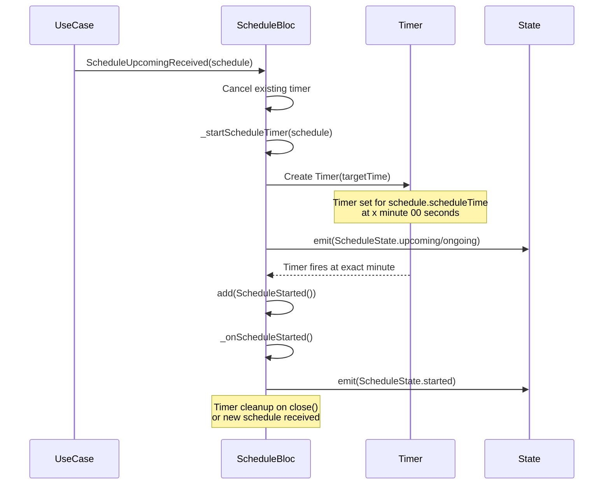

# Schedule Timer System

The OnTime app includes an automatic timer system within the `ScheduleBloc` that manages precise timing for schedule start notifications. This system ensures that schedule start events are triggered at the exact scheduled time.

## 🎯 Overview

The timer system automatically:

- Starts when an upcoming schedule is received
- Triggers a `ScheduleStarted` event at exactly x minute 00 seconds
- Handles proper cleanup and timer management
- Ensures thread-safety and prevents memory leaks

## 🔄 Timer Flow



## 📋 Implementation Details

### Key Components

1. **Timer Management**

   - `_scheduleStartTimer`: Dart Timer instance that handles the countdown
   - `_currentScheduleId`: Tracks the active schedule to prevent stale events

2. **Event Handling**

   - `ScheduleUpcomingReceived`: Triggers timer setup
   - `ScheduleStarted`: Fired when timer completes

3. **State Transitions**
   - `upcoming` → `started`: When timer fires for upcoming schedules
   - `ongoing` → `started`: When timer fires for preparation-in-progress schedules

### Timer Calculation

The timer calculates the exact target time as:

```dart
final targetTime = DateTime(
  scheduleTime.year,
  scheduleTime.month,
  scheduleTime.day,
  scheduleTime.hour,
  scheduleTime.minute,
  0, // Always trigger at 00 seconds
  0, // 0 milliseconds
);
```

### Safety Features

- **Timer Cancellation**: Previous timers are automatically cancelled when new schedules arrive
- **Bloc State Validation**: Timer callbacks verify the bloc is still active before firing events
- **Schedule ID Matching**: Events only fire for the currently tracked schedule
- **Proper Cleanup**: All timers are cancelled when the bloc is disposed

## 🛡️ Error Handling

The system includes several safety mechanisms:

1. **Past Schedule Protection**: Timers are not set for schedules in the past
2. **Bloc Lifecycle Management**: Timer callbacks check `isClosed` before adding events
3. **Memory Leak Prevention**: All timers are properly cancelled in `close()`
4. **Race Condition Prevention**: Schedule ID tracking prevents stale timer events

## 📱 Usage Example

The timer system works automatically within the `ScheduleBloc`:

```dart
// When a new schedule is received
bloc.add(ScheduleSubscriptionRequested());

// The bloc will:
// 1. Listen for upcoming schedules
// 2. Automatically start timers for each schedule
// 3. Emit ScheduleStarted events at the exact scheduled time
// 4. Transition to 'started' state

// Listen for state changes
bloc.stream.listen((state) {
  if (state.status == ScheduleStatus.started) {
    // Handle schedule start (e.g., show notification, start tracking)
  }
});
```

## 🔧 Configuration

The timer system requires no additional configuration and works automatically with:

- Any `ScheduleWithPreparationEntity` that has a valid `scheduleTime`
- Both upcoming and ongoing schedule states
- All timezone-aware DateTime calculations

## 📊 Performance Considerations

- **Single Timer**: Only one timer runs at a time per bloc instance
- **Minimal Memory Footprint**: Timers are created/destroyed as needed
- **Precise Timing**: Uses Dart's native Timer for accurate scheduling
- **Efficient Cleanup**: No lingering resources after bloc disposal

## 🚀 Future Enhancements

Potential improvements to consider:

- Multiple concurrent schedule timers
- Configurable timer precision (seconds vs milliseconds)
- Timer persistence across app restarts
- Integration with system-level scheduling APIs
